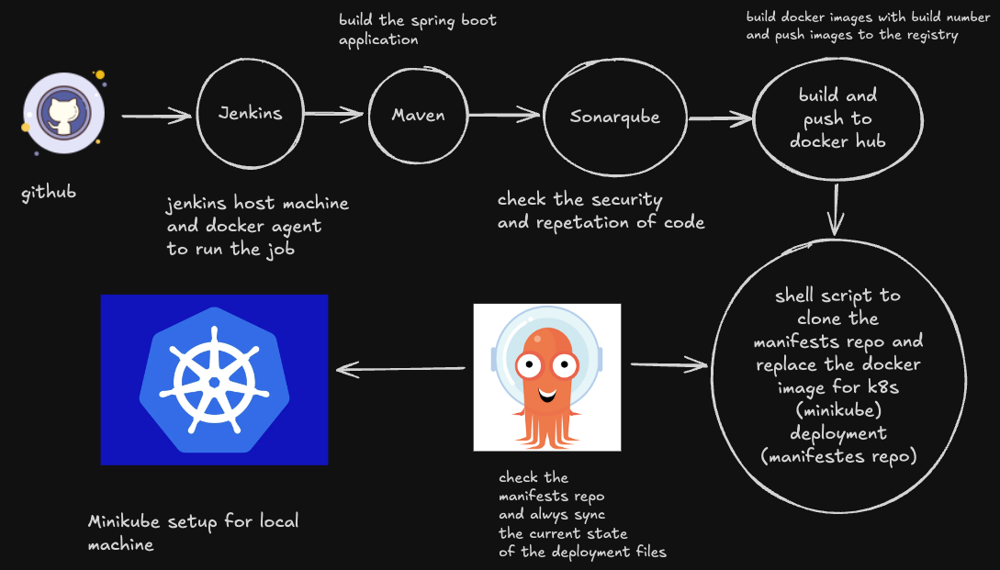

# CI/CD Pipeline for Java Application using Jenkins, Maven, SonarQube, Argo CD, and Minikube

This guide provides a step-by-step setup of an end-to-end Jenkins pipeline for a Java application. The pipeline integrates with tools like SonarQube for code quality checks, Argo CD for Kubernetes-based deployments, and Minikube for local Kubernetes clusters.



## Prerequisites

Before starting, ensure the following are available:

- Java application code hosted on a Git repository
- Jenkins Server ([Jenkins Installation Guide](https://www.jenkins.io/doc/book/installing/linux/#debianubuntu))
- Minikube installed locally ([Minikube Installation Guide](https://minikube.sigs.k8s.io/docs/start/))
- SonarQube Server ([SonarQube Installation Guide](https://docs.sonarsource.com/sonarqube/10.4/setup-and-upgrade/install-the-server/installing-sonarqube-from-zip-file/))
- Argo CD for continuous deployment

## Step-by-Step Guide

### 1. Install Necessary Jenkins Plugins

1. **Docker Pipeline Plugin**:  
   This allows us to run the pipeline inside a Docker agent, simplifying environment management (e.g., cleaning up images, automatic removal of containers, and volume handling).
   
2. **SonarQube Scanner for Jenkins**:  
   Required for integrating SonarQube code quality analysis into the Jenkins pipeline.

---

### 2. Create a New Jenkins Pipeline

1. **Create a pipeline job** in Jenkins and configure it with the Git repository URL of your Java application.
2. **Add the Jenkinsfile** path from your repository.

---

### 3. Set Jenkins Variable

1. **Generate Github Personal Access Token** You need to generate personal access token and save in credentials section as a secret.
2. **Docker Credentials** For push the docker image, you need to store the docker credentials.
3. **SonarQube Token** For accessing SOnarQube, you need to generate sonarqube secret token and store this to the jenkins.
3. **SonarQube IP Address** For accessing SonarQube Server, you can store the IP Address but its optional.
3. **Github Email Address** You can store the github email address but its optional.

---

### 4. Define Jenkins Pipeline Stages

- **Stage 1: Checkout Code**  
  Checkout the source code from the Git repository.

- **Stage 2: Build Application**  
  Build the Java application using Maven.

- **Stage 3: Code Quality Analysis**  
  Run SonarQube analysis for code quality checks.

- **Stage 4: Build Docker Image**  
  Build and push the Docker image to a Docker registry.

- **Stage 5: Update Kubernetes Manifests**  
  Clone the manifest repository, make necessary changes, and push updated files for Argo CD.

---

### 5. Install Minikube on Local Machine

To deploy the application locally on Kubernetes, Minikube must be installed.

- Follow the official documentation for Minikube installation:  
  [Minikube Installation Guide](https://minikube.sigs.k8s.io/docs/start/)

---

### 6. Setting up Argo CD

1. **Install Argo CD** on your Kubernetes cluster. Click the install button to find the full process. ([Argo CD installation](https://operatorhub.io/operator/argocd-operator))
2. Install the Argo CD default cluster by following this. Create a YML file, paste the configuration, and apply your YML. ([Argo CD default clusters](https://argocd-operator.readthedocs.io/en/latest/usage/basics/))
3. Type the following command to check the services:

   ```bash
   kubectl get svc
   ```

   You should see the service `example-argocd-server`.

4. Now, type the following command to edit the service:

   ```bash
   kubectl edit svc example-argocd-server
   ```

   Find the `type: ClusterIP` and change it to `type: NodePort`.

5. Now we can login to our Argo CD UI by tunneling. Type
    ```bash
    minikube service example-argocd-server
    ```
    It will provide you `http://` link for login to the Argo CD UI, do not close this terminal.
6. By default admin is the username and password is stored in the secret. Type 
    ```bash
    kubectl get secret
    ```
    You should get `example-argocd-cluster`. Now, type
    ```bash
    kubectl edit secret example-argocd-cluster
    ```
    copy the admin password but its encrypted, so we have to decode this. Now, type
    ```bash
    echo copy_password | base64 -d
    ```
    It will provide the password and ignore the `%` character if it appears. Now paste this to the UI and you should login to the Argo CD.
---

### 7. Configure Argo CD with Github

1. Click the Create Application
2. Give the application name
3. Give the project name to `default`
4. Select Sync `automatic`
5. Give the github repo URL
6. Give the path of deployment yml (e.g. if the deployment in the same level then put just `.` or you have to give the path).
7. Select the provided cluster url
8. Give `default` namespace in the namespace section

---

### 8. Run the Pipeline

- Trigger the Jenkins pipeline to start the CI process.
- Monitor the pipeline’s progress and resolve any issues during the stages.
- If build is successful then Argo CD will create the pods and services
- Find the service name and type 
```bash 
 minikube service service-name 
```
It will generate a tunnel url and you can access this by your browser.
- Change your code (e.g. add some text `hello world` and push to the github and trigger the pipeline)
- Argo CD will automatically observe the changes and deploy the deployment files

---

This guide automates the entire CI process for Java application, from code checkout to production deployment, using Jenkins, SonarQube, and CD process with Argo CD with Kubernetes(minikube) deployment.